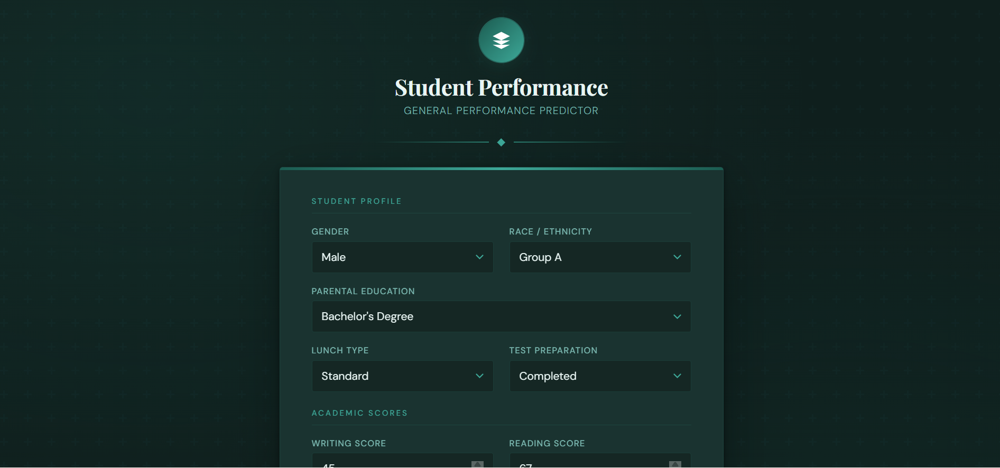
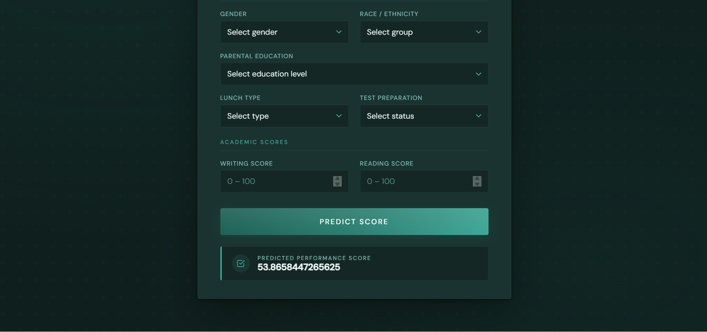
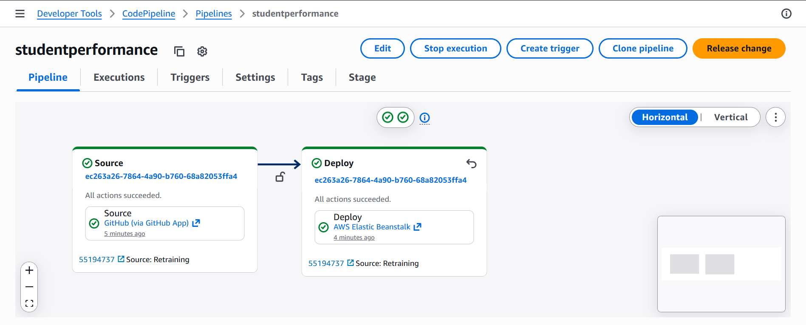
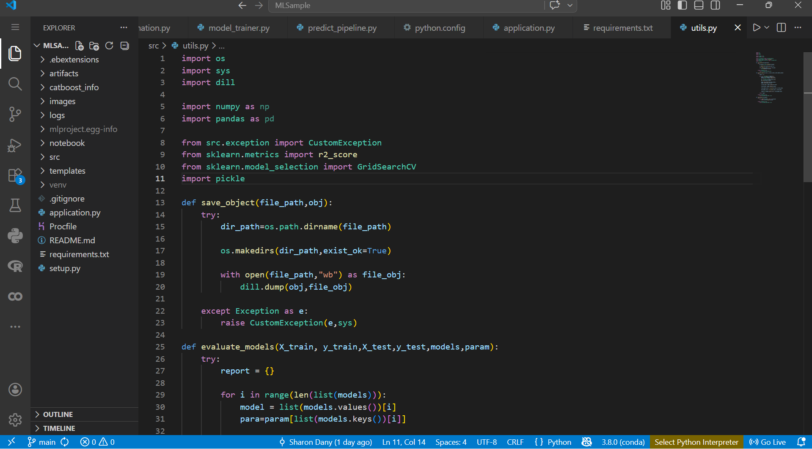

#  Student Performance Prediction

##  Overview

An end-to-end Machine Learning application that predicts student math performance based on demographic and academic features.

The project covers the full lifecycle of an ML system — from data preprocessing and model training to deployment and CI/CD on AWS.

---

## Features

* End-to-end ML pipeline (data → model → prediction)
* Flask-based web application
* Real-time prediction interface
* CI/CD pipeline using AWS CodePipeline
* Deployment using AWS Elastic Beanstalk

---

## Tech Stack

* Python
* Scikit-learn
* Flask
* Pandas, NumPy
* AWS Elastic Beanstalk
* AWS CodePipeline

---

## System Workflow

User Input → Flask App → Preprocessing → Model → Prediction
                    ↓
            AWS Elastic Beanstalk
                    ↓
             CI/CD Pipeline


---

## 📦 Project Structure

```
├── application.py
├── requirements.txt
├── Procfile
├── artifacts/
│   ├── model.pkl
│   └── preprocessor.pkl
├── src/
├── templates/
├── images/
└── README.md
```

---

##  Run Locally

### 1. Clone repository

```bash
git clone <https://github.com/Sharon-droid99/student-performance-predictor>
cd student-performance-predictor
```

### 2. Install dependencies

```bash
pip install -r requirements.txt
```

### 3. Run application

```bash
python application.py
```

### 4. Open in browser

```
http://localhost:5000
```

---

## Deployment

* Deployed using AWS Elastic Beanstalk
* Automated using AWS CodePipeline (CI/CD)

---

## Key Learnings

* Built a complete ML pipeline
* Handled model serialization and deployment
* Solved real-world deployment issues (version mismatch, environment errors)
* Implemented CI/CD for ML applications

---

##  Demo 







---


## Summary

This project demonstrates a production-style ML workflow, combining machine learning, backend development, and cloud deployment.
